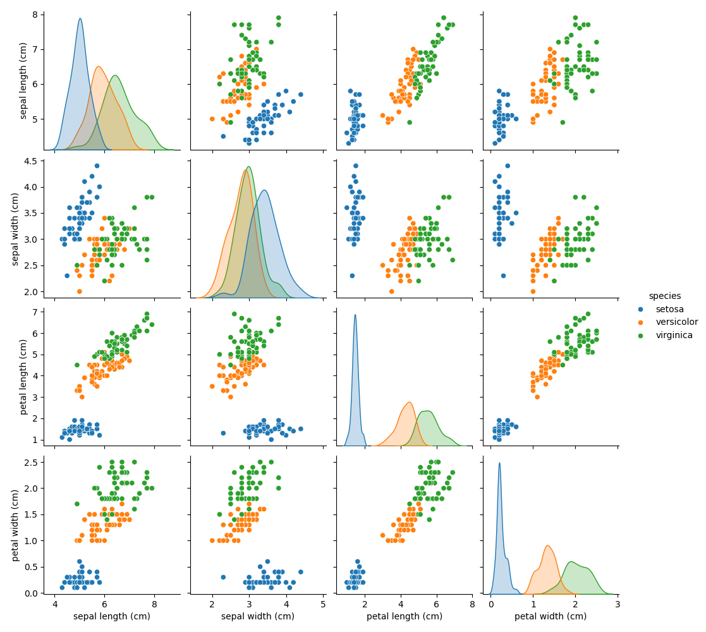
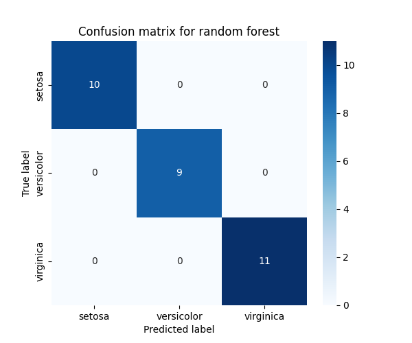
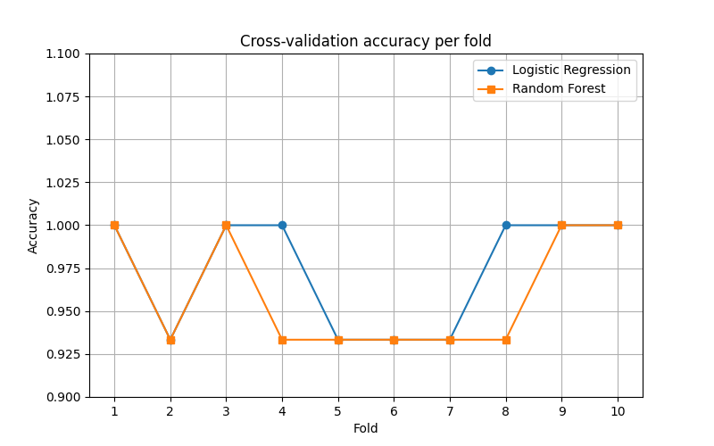
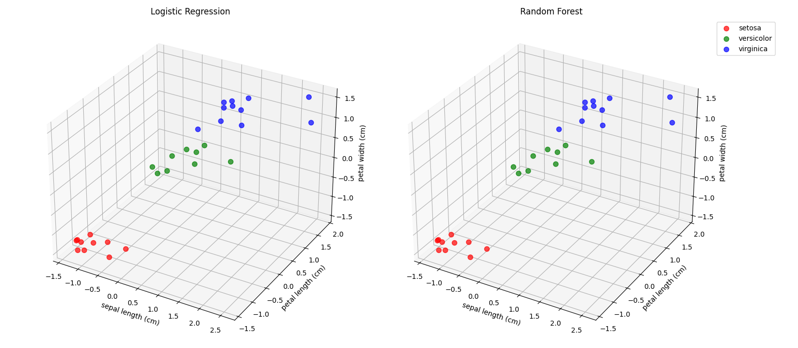

# Iris Classification with Machine Learning

## **Project description**
This project uses classic Iris dataset from the "sklearn" module. It includes data preprocessing, training machine learning models, evaluating their performance, and visualizing results.
The dataset contains only 150 samples, which makes it simple and ideal for exploring and comparing classification models. The results show near-perfect predictions, which is expected due to the dataset's simplicity and well-separated features. It also confirms that the selected models fit the data appropriately.
The project includes customized visualizations and implement two models: **Logistic Regression** and **Random Forest**, both with and without use of **Scikit-learn Pipelines**.

## **Features**
* ### Visualizations: 
  * Used heatmaps, line chart, bar chart and 3D scatter plot. 
  * Plots were customized for clarity and better interpretation of model performance.

* ### Machine Learning
  * Trained and evaluated **Logistic Regression** and **Random Forest** models.
  * Used an 80/20 train-test split.
  * Applied **10-fold cross-validation** to compare with the holdout method.

* ### Pipeline 
  * Pipelines were implemented as a demonstration of Scikit-learn's "Pipeline" feature.
  * The models were developed without pipelines for transparency and learning purposes.
  * Pipelines were added to encapsulate the workflow.
  * Pipeline was utilized for testing purposes.

* ### Testing
Automated tests were written used **Pytest** to verify pipeline correctness and utility function behavior. The tests include:

* Checking if metric extraction returns correct outputs ("precision", "recall", "f1-score")
* Verifying behavior with incorrect input data.
* Validating pipeline predictions using sample data.
* Ensuring classification reports are parsed as expected.

Test results are saved in tests/pytest_results.txt.

## **Tech Stack**
- Pandas
- Matplotlib
- Seaborn
- Scikit-learn
- NumPy
- Pytest

## **Project structure**
* /**data:** Data visualization folder
  * /**3d_visualization.png**
  * /**class_report_visualization.png**
  * /**conf_matrix_log_reg.png**
  * /**conf_matrix_rand_forest.png**
  * /**cross_val_lim.png**
  * /**petal_visualization.png**
* /**tests:**
  * /**__init__.py**
  * /**test_pipeline.py:** File with testing for pipeline.
  * /**pytest_results.txt:** Text file with test results.
* /**__init__.py**
* /**iris_model.py:** Main file with data prep, model training, testing and visualization.
* /**README.md:** Main documentation of the project.

## **Data description & Visualization**
### Petal Visualization
* **File:** "petal_visualisation.png"
* **Description:** Basic exploratory plot showing petal features before any modeling.

---

### Confusion Matrix - Logistic Regression
* **File:** "conf_matrix_log_reg.png"
* **Description:** Confusion Matrix for Logistic Regression predictions.
* **Conclusion:** Some misclassifications between  *versicolor* and *virginica*.

---

### Confusion Matrix - Random Forest
* **File:** "conf_matrix_rand_for.png"
* **Description:** Confusion Matrix for Random Forest predictions.
* **Conclusion:** Identical to Logistic Regression; both models perform equally well.

---

### Cross-Validation Results
* **File:** "cross_val_lin.png"
* **Description:** Shows 10-fold cross-validation scores for both models.
* **Conclusion:** Performance is very similar. Logistic Regression may be preferred due to its simplicity.

---

### Classification Report Metrics
* **File:** "class_report_visualization.png"
* **Description:** Comparison of precision, recall, and F1-score for both models.
* **Conclusion:** All metrics are close to 1, indicating excellent performance on this dataset.

---

### 3D Visualization of Predictions
* **File:** "3d_visualization.png"
* **Description:** 3D scatter plots showing predictions made by both models.
* **Conclusion:** Visual similarity reinforces that both models classify the test data in nearly the same way.

* 

---

## Final Thoughts
This project demonstrates the full workflow a small-scale machine learning process:
* Data loading and exploration.
* Model training and evaluation.
* Use of pipelines for cleaner and modular ML code.
* Multiple forms of result visualization.
* Testing pipeline with pytest.