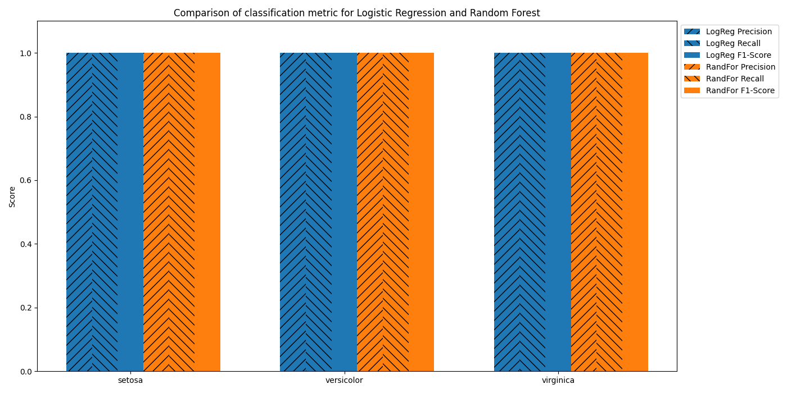

```Project status: In progress - Visualization.```


## **Project description**
This project utilises iris data from sklearn module, manipulates it, trains ml model and uses for prediction models visualization.
The data used in the project is pretty simple and covers only 150 cases (rows). Visualization of predictions and trainig/testing data shows close to perfection fit which corresponds with simplicity of the data but also confirm that chosen models properly correspond with the data.
The project uses visualisations, machine learning and pipeline for Logistic Regression and Random Forest models.

### Features
_Visualizations_: Used heatmaps, line chart, bar chart and 3D visualization of a combined charts. Plots were customized to express the data better.

_Machine Learning_: Utilized training, testing, predicting and fitting of the data for Logistic Regression and Random Forest models. Used standard 20% of the data for testing and compared results with cross validation aproach for 10 fold.

_Pipeline_: Pipeline was used solely for demonstration of a feature in Scikit-learn module. It was not utilized during the process of training and testing.


### Tech Stack
- Pandas
- Matplotlib
- Seaborn
- Scikit-learn


### Project structure
* /**data:** Data visualization folder
  * /**3d_visualization.png**
  * /**class_report_visualization.png**
  * /**conf_matrix_log_reg.png**
  * /**conf_matrix_rand_forest.png**
  * /**cross_val_lim.png**
  * /**petal_visualization.png**
* /**iris_model.py:** Main file with models training, testing and visualization.
* /**README.md:** Main documentation of the project.


### Data description
* "petal_visualisation.png": Basic visualization of the iris data before any train or test.

* "conf_matrix_log_reg.png": Visualization of a confusion matrix for logistic regression prediction model. It shows where the model is and isn't accurate.
  * **Conclusion:** 'versicolor' class is confused with 'virginica' sometimes.

* "conf_matrix_rand_forest.png": Visualization of a confusion matrix for random forest prediction model. It shows where the model is and isn't accurate.
  * **Conclusion:** Logistic regression and random forest confusion matrix are the same. It shows that both work fine on the dataset.

* "cross_val_lin.png": Linear model for logistic regression and random forest cross-validation 10-fold results.
  * **Conclusion:** Both models return similar results with small differences. It may be worth to use simpler model which is logistic regression.

* "class_report_visualization.png": Classification report visualization for logistic regression and random forest.
  * **Conclusion:** All values are on 1 which means that both models perfectly fit in the data and prediction.

* "3d_visualization.png": 3D representation of a logistic regression and random forest data fitting.
  * **Conclusion:** Both plots are almost the same which confirms simplicity of the data.
